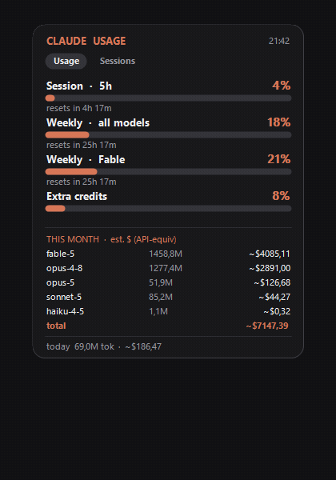

# Claude Usage Widget

A tiny always-on-top Windows widget for **Claude Code** that answers the question you keep
asking: *where was I?*

Closing a Claude Code window is easy. Getting back to it is not — you don't remember which
conversations existed, in which folder, or where each one stopped. This lists them by name and
puts you back in one click. It also keeps a running count of the tokens you have burned this
month, per model.

**It reads local files and nothing else** — no network calls, no credentials, no account access.
See [why there are no plan-limit bars](#why-there-are-no-plan-limit-bars).

<p align="center">
  
  &nbsp;&nbsp;
  
</p>

<p align="center">
  
</p>

## Download

Grab the [latest release](https://github.com/mosmondor/claude-usage-widget/releases/latest):

- **`…-selfcontained.zip`** — one 68 MB exe, nothing to install at all. Unzip, run, done.
- **`…-framework-dependent.zip`** — 200 KB, needs the
  [.NET 8 Desktop Runtime](https://dotnet.microsoft.com/download/dotnet/8.0).

No installer, no service, no autostart unless you add one: it is a single exe that puts an icon
in your tray.

## What it shows

**Sessions** — a launcher for your named conversations, grouped by project:

- One row per session, showing the name you gave it with `/rename` or `claude -n <name>`
- **Running sessions** come first, marked live with their status (`busy` / `idle`).
  Clicking one **brings its terminal window to the front**
- **Closed sessions** reopen on click, via `claude -r <session>` in the right folder
- Hovering a project shows **+ new**, which starts a fresh conversation there

Only named sessions are listed — a name is what makes a conversation recognisable weeks later,
and the list stays short. A running session is always shown even if it has no name yet.

**Usage** — what you have spent, computed from your own transcripts:

- **This month, per model** — token volume + a rough **API-equivalent** cost estimate
- **Today** — total tokens + estimate

Borderless floating card, drag with the left mouse button, right-click (or the tray icon) for the menu.

Sessions are started with a clean environment: if the widget itself was launched from inside a
Claude Code session, it would otherwise pass on markers like `CLAUDE_CODE_CHILD_SESSION`, and the
new session would silently stop saving its transcript. Variables you have set persistently are
kept — those are configuration, not inherited markers.

## How it works

Local files only. The widget makes no network requests of any kind and never touches your
credentials:

1. **Per-model token counts** are computed by scanning your local Claude Code
   transcripts in `~/.claude/projects/**/*.jsonl` (the `message.usage` fields).
   Records are de-duplicated globally by message id (Claude Code writes the same
   message into multiple files) and filtered to Claude models only.
2. **The session list** is assembled from three places Claude Code already maintains:
   `~/.claude/sessions/<pid>.json` for the processes running right now (the file name is
   the pid, and it is verified against a real claude process before a session counts as
   live); `~/.claude/history.jsonl`, the prompt log, for which conversations exist, in
   which folder, and when each was last touched; and each session's own transcript, which
   is the only place its name is recorded. Read-only: the widget never writes to any of them.

## Why there are no plan-limit bars

Version 1.2 drew the same percentages as Claude Code's `/usage` — session, weekly, per-model.
It got them from an undocumented endpoint, `GET /api/oauth/usage`, using the OAuth token Claude
Code stores locally. **That was not permitted, and it has been removed.**

Claude Code's own [legal and compliance page](https://code.claude.com/docs/en/legal-and-compliance)
states that OAuth authentication "is intended exclusively for purchasers of Claude Free, Pro, Max,
Team, and Enterprise subscription plans and is designed to support ordinary use of Claude Code and
other native Anthropic applications", and that Anthropic "reserves the right to take measures to
enforce these restrictions". The
[Consumer Terms](https://www.anthropic.com/legal/consumer-terms) separately prohibit accessing the
Services "through automated or non-human means, whether through a bot, script, or otherwise"
except via an Anthropic API key. This widget is not a native Anthropic application and does not
use an API key, so the whole path had to go.

There is no compliant substitute. Claude Code's officially supported
[OpenTelemetry export](https://code.claude.com/docs/en/monitoring-usage)
(`CLAUDE_CODE_ENABLE_TELEMETRY=1`) emits `claude_code.token.usage` and `claude_code.cost.usage`,
which covers token and cost figures — but explicitly not plan or rate-limit utilisation. For those
percentages, run `/usage` inside Claude Code. That is what it is for.

## Requirements

- Windows
- [.NET 8 Desktop Runtime](https://dotnet.microsoft.com/download/dotnet/8.0) (LTS)
  — only for the framework-dependent build
- Claude Code, for there to be anything to read
- **Optional:** [Windows Terminal](https://github.com/microsoft/terminal). With it, a session
  opens as a new **tab** in your existing window, named after the project
  (`wt -w 0 nt -d <cwd> --title <project> pwsh -NoExit -Command claude -r <id>`).
  Without it the widget falls back to a plain shell window per session.

## Build & run

```sh
dotnet build ClaudeUsageWidget.sln -c Release
dotnet test  ClaudeUsageWidget.sln -c Release
# then run ClaudeUsageWidget/bin/Release/net8.0-windows/ClaudeUsageWidget.exe
```

To start it automatically at login, drop a shortcut to the exe into
`shell:startup`.

## Project layout

- **`ClaudeUsageWidget.Core`** — parsing, pricing, de-duplication, the month-scoped
  transcript store, and the session readers / launcher command. No UI dependency, fully
  unit-tested.
- **`ClaudeUsageWidget`** — the WinForms tray + floating-card UI (`net8.0-windows`).
- **`ClaudeUsageWidget.Tests`** — 76 xUnit tests (parsing, dates/timezone, pricing, de-dup, cache,
  session reading, name resolution, grouping, launch command, environment scrubbing).

### Where session names come from

A session's name is not kept in any index — it lives only inside that session's own transcript,
written there by `/rename` (or by the reminder Claude Code injects when you pass `-n`). Transcripts
run to hundreds of megabytes in total, so resolving names is bounded twice: a running session's name
is read from its session file for free, and a closed session's transcript is scanned once and cached
against its mtime + size. Since a closed transcript never changes again, it is never re-read.

For the rare running session with no name, the fallback label is the first prompt with actual
substance — not a slash command, not a `!` passthrough, not a `[Pasted text …]` placeholder, and at
least 12 characters, which is what rules out "continue" and "ok".

### De-duplication rule

Claude Code writes the same assistant message into several transcript files, and retries can
report different token counts for one message id. To stay order-independent, when several records
share a message id the **canonical** one is the record with the greatest total tokens (ties broken
by output, then input, then cache-read, then cache-write). Records without an id are all kept.

## Caveats

- **The `$` figures are a rough, notional API-equivalent estimate — not a bill.**
  On a Pro/Max subscription you pay a flat fee; the `$` shown is roughly "what
  this would cost on the pay-per-token API". Because most agentic usage is
  cache reads, the totals look large but cost little.
- **Fable's public price isn't known**, so it is priced at the Opus tier, which
  makes the estimate run high. For an authoritative dollar figure use
  [`ccusage`](https://github.com/ryoppippi/ccusage). Adjust the rates in
  `Pricing.For(...)` if you want.
- The files it reads are **Claude Code internals** and are not a documented interface —
  they can change shape without warning, and this will break when they do. It is a personal
  convenience tool; use at your own risk.

## License

MIT — see [LICENSE](LICENSE).
