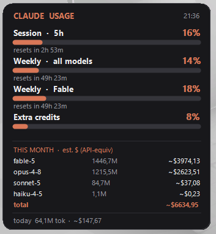
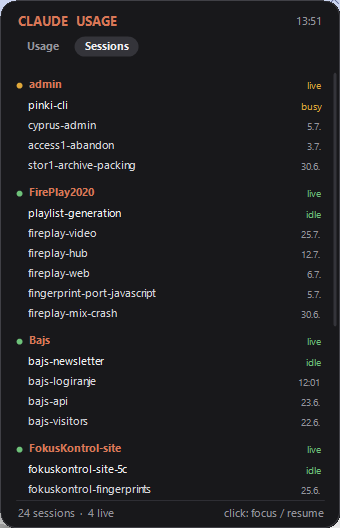

# Claude Usage Widget

A tiny always-on-top Windows desktop widget for **Claude Code**, with two pages.

**Usage** — your Claude subscription usage at a glance:

- **Plan limits** — the same numbers as Claude Code's `/usage`:
  - **Session** (rolling 5-hour window) — % used + reset countdown
  - **Weekly · all models** — % used + reset
  - **Weekly · per model** (e.g. Fable) — % used + reset
  - **Extra credits** (if enabled)
- **This month, per model** — token volume + a rough **API-equivalent** cost estimate
- **Today** — total tokens + estimate

**Sessions** — a launcher for your named conversations, grouped by project:

- One row per session, showing the name you gave it with `/rename` or `claude -n <name>`
- **Running sessions** come first, marked live with their status (`busy` / `idle`).
  Clicking one **brings its terminal window to the front**
- **Closed sessions** reopen on click, via `claude -r <session>` in the right folder
- Hovering a project shows **+ new**, which starts a fresh conversation there

Only named sessions are listed — a name is what makes a conversation recognisable weeks later,
and the list stays short. A running session is always shown even if it has no name yet.

Sessions are started with a clean environment: if the widget itself was launched from inside a
Claude Code session, it would otherwise pass on markers like `CLAUDE_CODE_CHILD_SESSION`, and the
new session would silently stop saving its transcript. Variables you have set persistently are
kept — those are configuration, not inherited markers.

Borderless floating card, drag with the left mouse button, right-click (or the tray icon) for the menu.

<p align="center">
  
  &nbsp;&nbsp;
  
</p>

## How it works

Two independent local data sources — nothing is uploaded anywhere:

1. **Plan limits** come from Claude Code's own usage endpoint,
   `GET https://api.anthropic.com/api/oauth/usage`, authenticated with the OAuth
   access token that Claude Code stores in `~/.claude/.credentials.json`.
   The widget reads that token **locally at runtime** and sends it only to
   Anthropic's usage endpoint (exactly like Claude Code does). It is never
   stored, logged, or transmitted anywhere else.
2. **Per-model token counts** are computed by scanning your local Claude Code
   transcripts in `~/.claude/projects/**/*.jsonl` (the `message.usage` fields).
   Records are de-duplicated globally by message id (Claude Code writes the same
   message into multiple files) and filtered to Claude models only.
3. **The session list** comes from two files Claude Code already maintains:
   `~/.claude/sessions/<pid>.json` for the processes running right now (the file name
   is the pid, and it is verified against a real claude process before a session counts
   as live), and `~/.claude/history.jsonl` for the prompt log that makes closed
   sessions resumable and recognisable. Read-only: the widget never writes there.

## Requirements

- Windows
- [.NET 8 Desktop Runtime](https://dotnet.microsoft.com/download/dotnet/8.0) (LTS)
- Claude Code installed and logged in (for the plan-limit numbers)
- **Optional:** [Windows Terminal](https://github.com/microsoft/terminal). With it, a session
  opens as a new **tab** in your existing window, named after the project
  (`wt -w 0 nt -d <cwd> --title <project> pwsh -NoExit -Command claude -r <id>`).
  Without it the widget falls back to a plain shell window per session.

## Build & run

```sh
dotnet build ClaudeUsageWidget.sln -c Release
dotnet test  ClaudeUsageWidget.sln -c Release
# then run ClaudeUsageWidget/bin/Release/net8.0-windows/ClaudeUsageWidget.exe
```

To start it automatically at login, drop a shortcut to the exe into
`shell:startup`.

## Project layout

- **`ClaudeUsageWidget.Core`** — parsing, pricing, de-duplication, the month-scoped
  transcript store, and the session readers / launcher command. No UI dependency, fully
  unit-tested.
- **`ClaudeUsageWidget`** — the WinForms tray + floating-card UI (`net8.0-windows`).
- **`ClaudeUsageWidget.Tests`** — xUnit tests (parsing, dates/timezone, pricing, de-dup, cache,
  session reading, grouping, launch command).

### Where session names come from

A session's name is not kept in any index — it lives only inside that session's own transcript,
written there by `/rename` (or by the reminder Claude Code injects when you pass `-n`). Transcripts
run to hundreds of megabytes in total, so resolving names is bounded twice: a running session's name
is read from its session file for free, and a closed session's transcript is scanned once and cached
against its mtime + size. Since a closed transcript never changes again, it is never re-read.

For the rare running session with no name, the fallback label is the first prompt with actual
substance — not a slash command, not a `!` passthrough, not a `[Pasted text …]` placeholder, and at
least 12 characters, which is what rules out "continue" and "ok".

### De-duplication rule

Claude Code writes the same assistant message into several transcript files, and retries can
report different token counts for one message id. To stay order-independent, when several records
share a message id the **canonical** one is the record with the greatest total tokens (ties broken
by output, then input, then cache-read, then cache-write). Records without an id are all kept.

## Caveats

- **The `$` figures are a rough, notional API-equivalent estimate — not a bill.**
  On a Pro/Max subscription you pay a flat fee; the `$` shown is roughly "what
  this would cost on the pay-per-token API". Because most agentic usage is
  cache reads, the totals look large but cost little.
- **Fable's public price isn't known**, so it is priced at the Opus tier, which
  makes the estimate run high. For an authoritative dollar figure use
  [`ccusage`](https://github.com/ryoppippi/ccusage). Adjust the rates in
  `Pricing.For(...)` if you want.
- The plan-limit endpoint is **undocumented / internal** and may change at any
  time. This is a personal convenience tool; use at your own risk.

## License

MIT — see [LICENSE](LICENSE).
